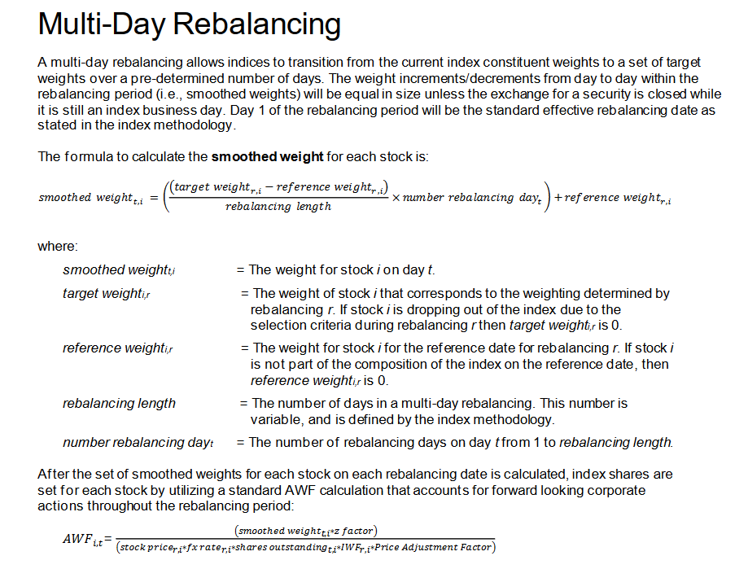

# 'Fantasy Portfolios'

A flask app for users to create a custom, daily rebalanced indices of U.S equities and ETFs. Also supports a more simple, one time balanced customized portfolio to answer the question of "what if I had bought \***\*\_\_\_\*\*** and left it alone?"

## Background // Why'd you do this?

This started as an effort to democratize index calculation and ETF composition for investors and traders who don't work in QIS or any similar structuring role. In my work as a quant in the indexing space, I learned all the nuances of index calculation, rebalancing, and volatility control that weren't remotely taught through schooling.

I didn't even realize that the DJIA wasn't rebalanced daily until I found the methodology and saw for myself. This was only after an hour or two of staring at my notebook at 2 A.M in the WeWork wondering why my own calculation, using the same exact market data, wasn't adding up.

Way too many S&T bros I know are eager to explain rebalances and how ETFs aren't just piles of stocks without offering any actual insight to curious people. I wanted to include the ability to differentiate between a buy-and-forget portfolio and a daily index to offer a better, visual understanding rather than pointing people at methodology documents.

I hope this reaches students who are interested in quantitative careers out of undergrad. I feel like roles in S&T and market making are unnecessarily gate kept in terms of the accessability of concepts to undergraduate students. I'm extremely grateful to the faculty at NYU's Department of Financial and Risk Engineering, who made active efforts to be inclusive and offer academic structure for undergradutes despite being a masters-only program.

### ETF/Index vs 'Fixed' Portfolio

The two seperate modes of calculation are to differentiate between a fixed portfolio and a daily rebalanced index.

Lets take a portfolio worth $1000, with 50% in equity $ABC, and 50% in $XYZ. Lets assume $ABC and $XYZ both are trading at $10

After 1 day, $ABC records a 10% gain, closing at exactly $11/share. This same day, $XYZ suffered a 10% loss, closing at $9/share, the portfolio will still be worth $1000. However, our portfolio is no longer balanced! At market open on day 2, our stake in $ABC will be worth $550, making it 55% of our portfolio. This is how a typical retail investor's portfolio would be; this feature is for 'what if I owned **\_\_** back in **\_\_\_** and left it alone?'. Please use this liberally to dunk on your friends and family about how smart they woulda coulda shoulda been had they bought [your favorite mid cap shady company] in [a year where you were too young to buy it yourself].

However, lets treat our portfolio like an index, where the promise to the customer is a constant exposure to ABC and XYZ at the same amount. The next day, we would want to offload $50 worth of $ABC, and acquire $50 worth of $XYZ in order for our portfolio to be balanced again. This is what firms who host any index ETFs are responsible for when the SPX is rebalanced quarterly (that is). Please feel free to share your robust indices with me on twitter or linkedin. Or inverse some Stern/Wharton professor you hate.

## Acknowledgments

Inspiration, code snippets, etc.

- [awesome-readme](https://github.com/matiassingers/awesome-readme)
- [DJIA Index Methodology](https://www.spglobal.com/spdji/en/documents/methodologies/methodology-dj-averages.pdf)
-
